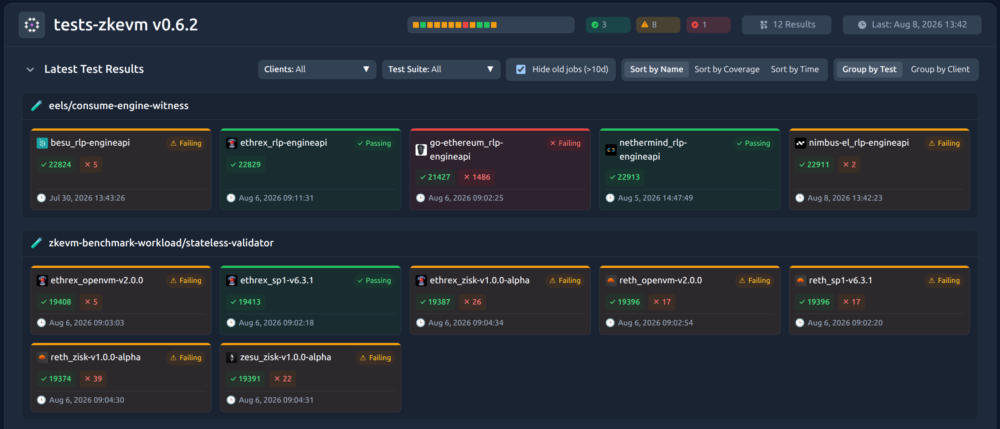

# EIP-8025 readiness for Hegotá

This document is a single-page document that summarizes the current state of readiness for EIP-8025.

## Summary

Readiness work is organized into four technical workstreams:

| Workstream | Status |
| --- | --- |
| Execution layer | **Implemented and tested; maintenance and improvements in progress; upstreaming once considered for inclusion** |
| Consensus layer | **Specifications merged upstream; clients implemented and interoperability tested; maintenance and improvements in progress; client upstreaming once considered for inclusion** |
| zkVMs | **Rubric and standards implementation in progress** |
| Infrastructure and tooling | **Implemented; maintenance and improvements in progress; upstreaming once considered for inclusion** |

## ACD progress

EIP-8025 was [PFIed in ACD #178 (May 14, 2026)](https://www.youtube.com/watch?t=4147&v=tZIY3IybQh4). The next step is proposing to CFI it.

The case for that, and the open questions around it, live in [ACD.md](ACD.md). This document is the readiness register.

## Execution layer

- **Specifications:** Defined in [`execution-specs@projects/zkevm`](https://github.com/ethereum/execution-specs/tree/projects/zkevm), open upstream as [`execution-specs#2268`](https://github.com/ethereum/execution-specs/pull/2268) against `forks/amsterdam`.
  - Stateful execution layer (EL) specifications for guest program input generation.
  - End-to-end guest program specifications.
  - zkEVM test releases have been published and maintained since April 2025, initially in `execution-spec-tests` and now in `execution-specs` (newest first):
    - Current [`ethereum/execution-specs`](https://github.com/ethereum/execution-specs/releases) `tests-zkevm@` series:

      | Release | Based on |
      | --- | --- |
      | [`tests-zkevm@v0.8.0`](https://github.com/ethereum/execution-specs/releases/tag/tests-zkevm%40v0.8.0) | `glamsterdam-devnet-8` |
      | [`tests-zkevm@v0.6.2`](https://github.com/ethereum/execution-specs/releases/tag/tests-zkevm%40v0.6.2) | `glamsterdam-devnet-7` |
      | [`tests-zkevm@v0.6.1`](https://github.com/ethereum/execution-specs/releases/tag/tests-zkevm%40v0.6.1) | `glamsterdam-devnet-7` |
      | [`tests-zkevm@v0.6.0`](https://github.com/ethereum/execution-specs/releases/tag/tests-zkevm%40v0.6.0) | `glamsterdam-devnet-7` |
      | [`tests-zkevm@v0.5.0`](https://github.com/ethereum/execution-specs/releases/tag/tests-zkevm%40v0.5.0) | `glamsterdam-devnet-6` |
      | [`tests-zkevm@v0.4.1`](https://github.com/ethereum/execution-specs/releases/tag/tests-zkevm%40v0.4.1) | `bal-devnet-7` |

    - Original [`ethereum/execution-spec-tests`](https://github.com/ethereum/execution-spec-tests/releases) `zkevm@` series:

      | Release | Based on |
      | --- | --- |
      | [`zkevm@v0.4.0`](https://github.com/ethereum/execution-spec-tests/releases/tag/zkevm%40v0.4.0) | `bal-devnet-7` |
      | [`zkevm@v0.3.4`](https://github.com/ethereum/execution-spec-tests/releases/tag/zkevm%40v0.3.4) | `bal-devnet-3` |
      | [`zkevm@v0.3.3`](https://github.com/ethereum/execution-spec-tests/releases/tag/zkevm%40v0.3.3) | `bal-devnet-3` |
      | [`zkevm@v0.3.2`](https://github.com/ethereum/execution-spec-tests/releases/tag/zkevm%40v0.3.2) | `bal-devnet-3` |
      | [`zkevm@v0.3.1`](https://github.com/ethereum/execution-spec-tests/releases/tag/zkevm%40v0.3.1) | `bal-devnet-3` |
      | [`zkevm@v0.3.0`](https://github.com/ethereum/execution-spec-tests/releases/tag/zkevm%40v0.3.0) | `bal-devnet-3` |
      | [`zkevm@v0.2.0`](https://github.com/ethereum/execution-spec-tests/releases/tag/zkevm%40v0.2.0) | — |
      | [`zkevm@v0.1.0`](https://github.com/ethereum/execution-spec-tests/releases/tag/zkevm%40v0.1.0) | — |
      | [`zkevm@v0.0.2`](https://github.com/ethereum/execution-spec-tests/releases/tag/zkevm%40v0.0.2) | — |
      | [`zkevm@v0.0.1`](https://github.com/ethereum/execution-spec-tests/releases/tag/zkevm%40v0.0.1) | — |

  - Formal verification (Planned!).

- **Testing:**
  - Integrated into the Ethereum Execution Spec Tests (EEST) framework (e.g. `t8n` changes, testing framework capabilities, and fixture format adjustments).
  - [Hive dashboard](https://eth-act.github.io/eest-execution-witness-dashboard/#/group/tests-zkevm%20v0.6.2) for stateful ELs and guest program compliance against EEST tests.

- **Documentation:** [Guest program handbook](https://github.com/eth-act/zkevm-standards/blob/main/handbooks/guest-handbook.md).

## Consensus layer

- **Specifications:** Merged in `consensus-specs` master, at [`ethereum/consensus-specs@master/specs/_features/eip8025`](https://github.com/ethereum/consensus-specs/tree/master/specs/_features/eip8025).
  - Proof-generating mode requests proofs and broadcasts them on the `execution_proof` gossip topic.
  - Proof-verifying mode consumes gossiped proofs and verifies them statelessly.
  - Includes the `ProofEngine` interface, proof gossip, request/response synchronization, and `eproof` Ethereum Node Record (ENR) discovery.
- **Client implementations:** [`eth-act/lighthouse@optional-proofs`](https://github.com/eth-act/lighthouse/tree/optional-proofs) and [`OffchainLabs/prysm@optional-proofs`](https://github.com/OffchainLabs/prysm/tree/optional-proofs) (Fulu-based).
- **Testing:** Kurtosis devnet with mocked and real proofs working (Fulu-based).

## zkVMs

- [zkVM handbook](https://github.com/eth-act/zkevm-standards/blob/main/handbooks/zkvm-handbook.md).
- [`eth-act/zkevm-standards`](https://github.com/eth-act/zkevm-standards).
- **Testing:** The [RISC-V Compliance Test Monitor](https://eth-act.github.io/zkevm-test-monitor/) publishes ISA compliance results for supported zkVMs ([source repository](https://github.com/eth-act/zkevm-test-monitor)).
- Formal verification progress (Planned!).

## Infrastructure and tooling

- **Proving:**
  - [`eth-act/ere`](https://github.com/eth-act/ere) — Provides a unified interface and toolkit for compiling, executing, proving, and verifying programs across multiple zkVMs.
  - [`eth-act/ere-guests`](https://github.com/eth-act/ere-guests) — Maintains reusable libraries and compilation tooling for Ethereum guest programs across zkVMs with Ere.
  - [`eth-act/zkevm-benchmark-workload`](https://github.com/eth-act/zkevm-benchmark-workload) — Benchmarks Ethereum guest programs execution, proving, and verification across multiple zkVMs using EEST test and benchmark releases, and real mainnet/devnet blocks.
  - [`eth-act/zkboost`](https://github.com/eth-act/zkboost) — Implements an EIP-8025 proof node that serves consensus-client requests for execution-proof generation and verification through Ere-backed zkVMs.
  - [`ethpandaops/proofessoor`](https://ethpandaops.io/docs/tooling/proofessoor/) — Requests proofs of Ethereum execution blocks from zkboost and tracks each request through completion.
- **Devnets:**
  - Mocked and real proving support in the Kurtosis [`ethereum-package`](https://github.com/ethpandaops/ethereum-package).
  - Stateless-input artifacts allowing EIP-8025 proving on Glamsterdam devnets:
    - [R2 bucket for `glamsterdam-devnet-5` stateless inputs](https://pub-5345007fbd06486bbb7cbbe9f3112c45.r2.dev/devnets/glamsterdam-devnet-5/index.html)
    - [R2 bucket for `glamsterdam-devnet-7` stateless inputs](https://pub-df22334654034ebab51bc096137a59d8.r2.dev/devnets/glamsterdam-devnet-7/index.html) 

## Coordination: zkEVM breakout calls

| Call | Date | Resources |
| ---: | --- | --- |
| 6 | July 8, 2026 | [Recording & notes](https://forkcast.org/calls/zkevm/006) · [Slides](breakout-calls/006/) |
| 5 | June 10, 2026 | [Recording & notes](https://forkcast.org/calls/zkevm/005) · [Slides](breakout-calls/005/) |
| 4 | May 13, 2026 | [Recording & notes](https://forkcast.org/calls/zkevm/004) · [Slides](breakout-calls/004/) |
| 3 | April 8, 2026 | [Recording & notes](https://forkcast.org/calls/zkevm/003) · [Slides](breakout-calls/003/) |
| 2 | March 11, 2026 | [Recording & notes](https://forkcast.org/calls/zkevm/002) · [Slides](breakout-calls/002/) |
| 1 | February 11, 2026 | [Recording & notes](https://forkcast.org/calls/zkevm/001) · [Slides](breakout-calls/001/) |

## Further reading

For technical deep dives on EIP-8025, zkVM performance, interoperability standards, and security, see the [zkEVM Team blog](https://zkevm.ethereum.foundation/blog).

## Appendix

Hive-dashboard screenshot:

